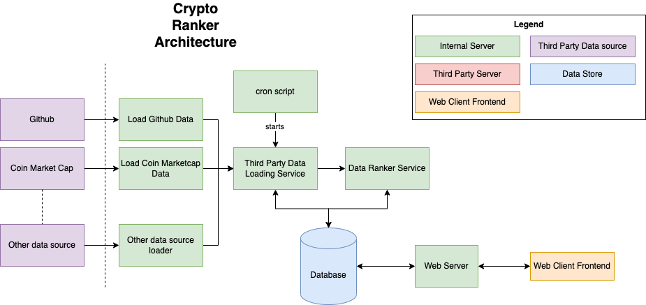

# Crytpto Github Ranker

This project will attempt to rate github projects by an unbiased set of criteria.  The criteria include:

- Number of commits - more is better
- Number of contributors - more is better
- Recency of last commit - more recent is better
- Frequency of commits - More frequent is better, but the most recent commits are ranked higher than the older commits.
- Number of issues - More is better, because that means there is active development
- Number of github stars
- Number of forks
- Ratio of open issues to closed issues - The ratio should be smaller
- Language used, bonus points for esoteric languages, minus points for smart contract languages like solidity.

## How the score is calculated

Each criteria is ranked in terms of a percentile, where the top 20% is ranked a 5, 80th percentile is 4, and bottom 20% is ranked a 1.  Each is rated by its recency.

## MVP Requirements

- [ ] Load a github url through the API
- [ ] Load all of the criteria and put the raw data into a data store
- [ ] Rank the data based on above criteria
- [ ] Display the data on a frontend# crypto-ranker

## Architecture

This diagram shows what the MVP's architecture will look like once it is all completed

### Components

- **Third Party data loading service** - Service to load raw data from third party websites
- **Data Source DB** - Database to have metadata about *where* to load the third party data from, and logs around loading
- **Data Processing Service** - Process the loaded data from all of the third party data sources, this will rank each project, and bundle the meaningful information together and store the data in the database.
- **Ranking Data DB** - This has all of the ranked crypto data, as well as the raw data that can be used to rank more projects
- **Web API** - A web API will allow users to query data from the database, and run custom queries
- **Data Bundling Service** - This will query the ranking data DB, and it will bundle it into meaningful data to the user, and store that data in a CDN for quick retrieval
- **Web Client** - The frontend of the website, this will be what the user sees, it will contain all of the ranking information
